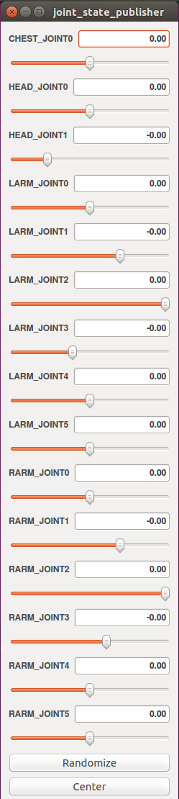

# Getting Started 3: Moving the robot in [Unity3D](https://unity3d.com/) using the [ROS](http://www.ros.org/) [joint_state_publisher](http://wiki.ros.org/joint_state_publisher)

In this getting started tutorial we show you how to move your [URDF](http://wiki.ros.org/urdf) model imported to [Unity3D](https://unity3d.com/) using [ROS](http://www.ros.org/) (in particular the [joint_state_publisher](http://wiki.ros.org/joint_state_publisher))
This tutorial is based on the [Getting Started 2](https://github.com/siemens/ros-sharp/wiki/GettingStarted2) and adds some further functionality explained below.

## Setting up the [Unity3D](https://unity3d.com/) project
To keep the setup as simple as possible a full Assets Package is provided [here](https://github.com/roehrlverena/ros-sharp/tree/master/Example/GettingStarted3/GettingStarted3Package.unitypackage)
* Start [Unity3D](https://unity3d.com/) and create a new project
* Go to `Assets` > `Import Package` > `Custom Package...` and select `GettingStarted3Package.unitypackage` from [ros-sharp/Example/GettingStarted3/GettingStarted3Package.unitypackage](https://github.com/roehrlverena/ros-sharp/tree/master/Example/GettingStarted3/GettingStarted3Package.unitypackage)
* Select all sources and press `Import`
* If not present already, create the following folders in the `/PATH_TO_YOUR_UNITY_PROJECT/Assets` folder and include the following files or DLLs in the folder `Assets/UrdfImporter/Plugins`:
 * `Newtonsoft.Json.dll` [Download here](http://www.newtonsoft.com/json)
 * `websocket-sharp.dll` [Download here](https://github.com/sta/websocket-sharp)

Now your setup is complete and in the hierarchy window you can see the three GameObjects `Patchers`, `ROSConnector`, both containing additional scripts and `NextageOpen` containing an example [robot](http://nextage.kawada.jp/en/open/).

<br />
<br />

## Setting up the Ethernet Connection between Windows and Ubuntu on the VM
Follow [Getting Started 2](https://github.com/siemens/ros-sharp/wiki/GettingStarted2) to set up the connection between your VM with [ROS](http://www.ros.org/) and [Unity3D](https://unity3d.com/).

## Installing and Setting up [ROS](http://www.ros.org/) on the Ubuntu VM
Follow [Getting Started 2](https://github.com/siemens/ros-sharp/wiki/GettingStarted2) to set up your [ROS](http://www.ros.org/) environment.

## Moving the robot in [Unity3D](https://unity3d.com/) using the  [joint_state_publisher](http://wiki.ros.org/joint_state_publisher)
Now let us test the functionality.
* in Ubuntu launch the `.launch` file explained in the [Getting Started 2](https://github.com/siemens/ros-sharp/wiki/GettingStarted2)
```
$ roslaunch file_server urdf_exporter.launch
```
You should get an output similar to the following:

```
verena@verena-VirtualBox:~$ roslaunch file_server file_server.launch
... logging to /home/verena/.ros/log/2ff20c20-a375-11e7-9590-080027a77078/roslaunch-verena-VirtualBox-4869.log
Checking log directory for disk usage. This may take awhile.
Press Ctrl-C to interrupt
Done checking log file disk usage. Usage is <1GB.

WARN: unrecognized 'param' tag in <include> tag
started roslaunch server http://verena-VirtualBox:38515/

SUMMARY
========

PARAMETERS
 * /robot/name: NextageOpen
 * /robot_description: <?xml version="1....
 * /rosapi/params_glob: [*]
 * /rosapi/services_glob: [*]
 * /rosapi/topics_glob: [*]
 * /rosbridge_websocket/address:
 * /rosbridge_websocket/authenticate: False
 * /rosbridge_websocket/bson_only_mode: False
 * /rosbridge_websocket/delay_between_messages: 0
 * /rosbridge_websocket/fragment_timeout: 600
 * /rosbridge_websocket/max_message_size: None
 * /rosbridge_websocket/params_glob: [*]
 * /rosbridge_websocket/port: 9090
 * /rosbridge_websocket/retry_startup_delay: 5
 * /rosbridge_websocket/services_glob: [*]
 * /rosbridge_websocket/topics_glob: [*]
 * /rosdistro: kinetic
 * /rosversion: 1.12.7
 * /use_gui: True

NODES
  /
    file_server (file_server/file_server)
    joint_state_publisher (joint_state_publisher/joint_state_publisher)
    robot_state_publisher (robot_state_publisher/state_publisher)
    rosapi (rosapi/rosapi_node)
    rosbridge_websocket (rosbridge_server/rosbridge_websocket)

auto-starting new master
process[master]: started with pid [4880]
ROS_MASTER_URI=http://localhost:11311

setting /run_id to 2ff20c20-a375-11e7-9590-080027a77078
process[rosout-1]: started with pid [4893]
started core service [/rosout]
process[joint_state_publisher-2]: started with pid [4907]
process[robot_state_publisher-3]: started with pid [4911]
process[rosbridge_websocket-4]: started with pid [4912]
process[rosapi-5]: started with pid [4913]
process[file_server-6]: started with pid [4926]
[ INFO] [1506510937.914012918]: ROSbridge File Server initialized.
registered capabilities (classes):
 - rosbridge_library.capabilities.call_service.CallService
 - rosbridge_library.capabilities.advertise.Advertise
 - rosbridge_library.capabilities.publish.Publish
 - rosbridge_library.capabilities.subscribe.Subscribe
 - <class 'rosbridge_library.capabilities.defragmentation.Defragment'>
 - rosbridge_library.capabilities.advertise_service.AdvertiseService
 - rosbridge_library.capabilities.service_response.ServiceResponse
 - rosbridge_library.capabilities.unadvertise_service.UnadvertiseService
[INFO] [1506510938.594029]: Rosbridge WebSocket server started on port 9090

```

Furthermore the `joint-state-controller` GUI containing sliders for each joint appears.<br />
<br />
* In [Unity3D](https://unity3d.com/) press Play
* In the GameObject `Patchers` press `apply JointStateManagers`
* In the GameObject `ROSConnector` insert the `Ros Bridge Server Url` as `ws://xxx.xxx.xxx.xxx:9090`
* In the GameObject `ROSConnector` press `Connect to ROS`
In the roslaunch terminal you should get the following output:
```
[INFO] [1508780182.095402]: Client connected.  1 clients total.
```
* In the GameObject `ROSConnector` press `Subscribe to joint states`
In the roslaunch terminal you should get the following output:
```
[INFO] [1508780294.564905]: [Client 0] Subscribed to /joint_states
```

Now moving the sliders of the `joint-state-controller` moves the corresponding joints of the robot in [Unity3D](https://unity3d.com/).

----
© Siemens AG, 2017
Author: Verena Röhrl (verena.roehrl@siemens.com)
